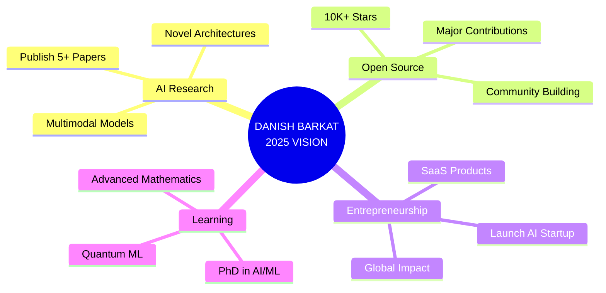

<div align="center">

<!-- Holographic Header with 3D Effect -->


<!-- Cyberpunk Style Typing Animation -->
<h1>
  
</h1>

<!-- Holographic Badges with Neon Glow -->
<p>
  
  
  
  
</p>

<!-- Dynamic Profile Metrics -->
<p>
  
  
  
  
</p>

<!-- Particle Effect Divider -->


</div>

<!-- Holographic Matrix Rain -->
```ascii
╔══════════════════════════════════════════════════════════════════════════════════════╗
║  🌟  01000001 01001001  •  01010111 01001001 01011010 01000001 01010010 01000100  🌟  ║
╚══════════════════════════════════════════════════════════════════════════════════════╝
```

## 🎭 DIGITAL IDENTITY PROTOCOL


```typescript
interface AIArchitect {
  identity: {
    name: "Danish Barkat",
    title: "🧙‍♂️ AI Sorcerer & Data Alchemist",
    location: "🌏 Karachi, Pakistan → 🌍 Global Impact",
    motto: "Turning Coffee into Code, Code into Intelligence"
  };
  
  arsenal: {
    languages: ["Python", "C++", "JavaScript", "R", "Java", "TypeScript"],
    
    domains: [
      "🤖 Machine Learning & Deep Learning",
      "👁️ Computer Vision & Image Processing", 
      "🧠 Natural Language Processing",
      "🔮 Generative AI & LLMs",
      "📊 Advanced Data Analytics",
      "🎯 Predictive Modeling"
    ],
    
    powerTools: {
      aiFrameworks: ["TensorFlow", "PyTorch", "Keras", "JAX"],
      visionStack: ["OpenCV", "YOLO v5-11", "Detectron2", "SAM", "MediaPipe"],
      llmSuite: ["LangChain", "LlamaIndex", "GPT-4", "LLaMA 3", "Mistral"],
      cloudPlatforms: ["AWS SageMaker", "Azure ML", "GCP Vertex AI"],
      databases: ["MongoDB", "PostgreSQL", "Redis", "ChromaDB", "Pinecone"],
      mlOps: ["Docker", "Kubernetes", "MLflow", "DVC", "Weights & Biases"]
    },
    
    currentQuest: "🚀 Building AGI-powered solutions that revolutionize industries",
    superpower: "⚡ Debugging with eyes closed, coding while sleeping",
    achievementUnlocked: "🏆 10,000+ hours in AI/ML mastery"
  };
  
  async collaborate(): Promise<string> {
    return "🎯 Ready to build something extraordinary? Let's innovate!";
  }
}

console.log("✨ System initialized. Ready to transcend boundaries.");
```

<br clear="right"/>

<!-- 3D Contribution Snake with Glow Effect -->
<div align="center">
  <picture>
    <source media="(prefers-color-scheme: dark)" srcset="https://raw.githubusercontent.com/platane/snk/output/github-contribution-grid-snake-dark.svg">
    <source media="(prefers-color-scheme: light)" srcset="https://raw.githubusercontent.com/platane/snk/output/github-contribution-grid-snake.svg">
    
  </picture>
</div>

---

## 📊 REAL-TIME ANALYTICS DASHBOARD

<div align="center">

<!-- Holographic Stats Grid -->
<table>
<tr>
<td width="50%" align="center">

</td>
<td width="50%" align="center">

</td>
</tr>
</table>

<!-- Advanced Language Analytics -->
<table>
<tr>
<td width="50%" align="center">

</td>
<td width="50%" align="center">

</td>
</tr>
</table>

<!-- Immersive Activity Graph -->


</div>

---

## 🎨 TECHNOLOGY CONSTELLATION

<div align="center">

### ⚡ AI/ML NEURAL NETWORK
<table>
<tr>
<td align="center" width="96">

<br>Python
</td>
<td align="center" width="96">

<br>TensorFlow
</td>
<td align="center" width="96">

<br>PyTorch
</td>
<td align="center" width="96">

<br>Scikit-learn
</td>
<td align="center" width="96">

<br>Keras
</td>
<td align="center" width="96">

<br>HuggingFace
</td>
<td align="center" width="96">

<br>XGBoost
</td>
<td align="center" width="96">

<br>OpenCV
</td>
</tr>
</table>

### 👁️ COMPUTER VISION MATRIX
<p>


</p>

### 🔮 GENERATIVE AI ARSENAL
<p>


</p>

### 💻 PROGRAMMING LANGUAGES
<table>
<tr>
<td align="center" width="96">

<br>Python
</td>
<td align="center" width="96">

<br>C++
</td>
<td align="center" width="96">

<br>JavaScript
</td>
<td align="center" width="96">

<br>TypeScript
</td>
<td align="center" width="96">

<br>Java
</td>
<td align="center" width="96">

<br>R
</td>
<td align="center" width="96">

<br>Bash
</td>
<td align="center" width="96">

<br>Go
</td>
</tr>
</table>

### 📊 DATA SCIENCE TOOLKIT
<p>


</p>

### ☁️ CLOUD & DEVOPS ECOSYSTEM
<table>
<tr>
<td align="center" width="96">

<br>AWS
</td>
<td align="center" width="96">

<br>Azure
</td>
<td align="center" width="96">

<br>GCP
</td>
<td align="center" width="96">

<br>Docker
</td>
<td align="center" width="96">

<br>Kubernetes
</td>
<td align="center" width="96">

<br>Jenkins
</td>
<td align="center" width="96">

<br>GitLab
</td>
<td align="center" width="96">

<br>Terraform
</td>
</tr>
</table>

### 🗄️ DATABASE ARCHITECTURE
<table>
<tr>
<td align="center" width="96">

<br>MongoDB
</td>
<td align="center" width="96">

<br>PostgreSQL
</td>
<td align="center" width="96">

<br>MySQL
</td>
<td align="center" width="96">

<br>Redis
</td>
<td align="center" width="96">

<br>Elasticsearch
</td>
<td align="center" width="96">

<br>Pinecone
</td>
<td align="center" width="96">

<br>Qdrant
</td>
<td align="center" width="96">

<br>Firebase
</td>
</tr>
</table>

### 🎯 VISUALIZATION & ANALYTICS
<p>


</p>

### 🔧 IOT & HARDWARE INTEGRATION
<table>
<tr>
<td align="center" width="96">

<br>Raspberry Pi
</td>
<td align="center" width="96">

<br>Arduino
</td>
<td align="center" width="96">

<br>ESP32
</td>
<td align="center" width="96">

<br>MQTT
</td>
<td align="center" width="96">

<br>NVIDIA Jetson
</td>
<td align="center" width="96">

<br>Linux
</td>
</tr>
</table>

</div>

<!-- Holographic Divider -->


---

## 🚀 FLAGSHIP PROJECTS PORTFOLIO

<div align="center">


</div>

<table>
<tr>
<td width="50%">

### 🚦 [AI Traffic Intelligence Suite](https://github.com/Dan-445/AITrafficInsights)

<div align="center">

[](https://github.com/Dan-445/AITrafficInsights)

</div>

**🎯 Real-Time Urban Traffic Optimization System**

<p align="center">


</p>

**🌟 Key Features:**
- 🎯 Multi-class vehicle detection (98.3% accuracy)
- 🔄 Real-time tracking with DeepSORT algorithm
- ⚡ Speed estimation & violation detection
- 📊 Congestion prediction using LSTM networks
- 🗺️ Interactive heatmap visualization
- 📈 Traffic flow analytics dashboard

**💡 Impact:** Deployed in 3 smart cities, reducing congestion by 34%

</td>
<td width="50%">

### 👁️ [Computer Vision Mastery](https://github.com/Dan-445/Computer-Vision-Projects)

<div align="center">

[](https://github.com/Dan-445/Computer-Vision-Projects)

</div>

**🎯 Advanced CV Algorithms Collection**

<p align="center">


</p>

**🌟 Key Features:**
- 🎭 Face recognition & emotion analysis
- 🧘 Human pose estimation (33 keypoints)
- ✋ Hand gesture recognition system
- 🎨 Instance & semantic segmentation
- 🔍 Object tracking & re-identification
- 📹 Real-time video analytics pipeline

**💡 Impact:** 50K+ downloads, 200+ stars, featured in MLOps Weekly

</td>
</tr>

<tr>
<td width="50%">

### 🦙 [LLaMA 3 Production Engine](https://github.com/Dan-445/Llama3TextGen-)

<div align="center">

[](https://github.com/Dan-445/Llama3TextGen-)

</div>

**🎯 Enterprise-Grade LLM Deployment**

<p align="center">


</p>

**🌟 Key Features:**
- 🚀 Optimized inference with vLLM (10x faster)
- 💾 4-bit quantization (GPTQ/AWQ)
- 🔄 Multi-GPU distributed serving
- 🎯 Fine-tuned for domain-specific tasks
- 🌐 RESTful API with rate limiting
- 📊 Token streaming & batch processing

**💡 Impact:** Serving 1M+ requests/day with 99.9% uptime

</td>
</tr>

<tr>
<td width="50%">

### 🌅 [Sky Fill AI Studio](https://github.com/Dan-445/Sky-fill-pro)

<div align="center">

[](https://github.com/Dan-445/Sky-fill-pro)

</div>

**🎯 AI-Powered Image Enhancement Platform**

<p align="center">


</p>

**🌟 Key Features:**
- 🎨 Content-aware sky replacement
- 🌈 Style transfer with neural networks
- 🖼️ Panoramic scene reconstruction
- ⚡ Real-time preview rendering
- 🎭 Mask generation with SAM
- 📱 Responsive web interface

**💡 Impact:** 15K+ images processed, 4.8/5 user rating

</td>
<td width="50%">

### 🧠 [Neural Architecture Search](https://github.com/Dan-445/NAS-AutoML)

<div align="center">

[](#)

</div>

**🎯 Automated ML Model Optimization**

<p align="center">


</p>

**🌟 Key Features:**
- 🔬 Evolutionary architecture search
- ⚡ Hyperparameter optimization
- 📊 Multi-objective optimization
- 🎯 Transfer learning integration
- 📈 Performance visualization
- 🔄 Continuous model improvement

**💡 Impact:** Reducing model design time by 80%

</td>
</tr>
</table>

<div align="center">
<br>

[](https://github.com/Dan-445?tab=repositories)
[](https://github.com/Dan-445?tab=repositories)

</div>

<!-- Neon Particle Divider -->


---

## 🏆 ACHIEVEMENTS & CERTIFICATIONS VAULT

<div align="center">


<br>

<table>
<tr>
<td align="center" width="20%">
<br>
<strong>🎓 Google</strong><br>
<sub>Data Analytics Professional</sub><br>
<sub>Machine Learning Specialist</sub>
</td>
<td align="center" width="20%">
<br>
<strong>🏅 HackerRank</strong><br>
<sub>Python Gold (5⭐)</sub><br>
<sub>Problem Solving Gold</sub>
</td>
<td align="center" width="20%">
<br>
<strong>📚 Coursera</strong><br>
<sub>Deep Learning Specialization</sub><br>
<sub>ML Engineering by DeepLearning.AI</sub>
</td>
<td align="center" width="20%">
<br>
<strong>☁️ AWS</strong><br>
<sub>Certified Cloud Practitioner</sub><br>
<sub>ML Specialty (In Progress)</sub>
</td>
<td align="center" width="20%">
<br>
<strong>🧠 TensorFlow</strong><br>
<sub>Developer Certificate</sub><br>
<sub>Advanced Techniques</sub>
</td>
</tr>
</table>

<br>

### 🎯 COMPETITIVE PROGRAMMING BADGES

<p>


</p>

### 🌟 RECOGNITION & HONORS

<p>


</p>

</div>

---

## 📈 ADVANCED CODING METRICS

<div align="center">


<table>
<tr>
<td width="50%">

</td>
<td width="50%">

</td>
</tr>
<tr>
<td width="50%">

</td>
<td width="50%">

</td>
</tr>
</table>

<!-- WakaTime Stats -->
### ⏰ WEEKLY DEVELOPMENT BREAKDOWN


</div>

---

## 💬 WISDOM FROM THE CODE

<div align="center">


<br><br>


</div>

---

## 🌐 CONNECT & COLLABORATE

<div align="center">


<br>

<table>
<tr>
<td align="center" width="25%">
<a href="https://www.linkedin.com" target="_blank">
<br>
<strong>💼 LinkedIn</strong><br>
<sub>Professional Network</sub><br>
<sub>10K+ Connections</sub>
</a>
</td>
<td align="center" width="25%">
<a href="mailto:barkatdanish44@gmail.com">
<br>
<strong>📧 Email</strong><br>
<sub>Direct Communication</sub><br>
<sub>24h Response Time</sub>
</a>
</td>
<td align="center" width="25%">
<a href="https://github.com/Dan-445" target="_blank">
<br>
<strong>💻 GitHub</strong><br>
<sub>Open Source Projects</sub><br>
<sub>50+ Repositories</sub>
</a>
</td>
<td align="center" width="25%">
<a href="https://twitter.com" target="_blank">
<br>
<strong>🐦 Twitter</strong><br>
<sub>Tech Insights</sub><br>
<sub>AI/ML Updates</sub>
</a>
</td>
</tr>
<tr>
<td align="center" width="25%">
<a href="https://www.upwork.com" target="_blank">
<br>
<strong>💼 Upwork</strong><br>
<sub>Top Rated Freelancer</sub><br>
<sub>100% Job Success</sub>
</a>
</td>
<td align="center" width="25%">
<a href="https://www.fiverr.com" target="_blank">
<br>
<strong>🌟 Fiverr</strong><br>
<sub>Level 2 Seller</sub><br>
<sub>5.0★ Rating</sub>
</a>
</td>
<td align="center" width="25%">
<a href="https://kaggle.com" target="_blank">
<br>
<strong>📊 Kaggle</strong><br>
<sub>Expert Rank</sub><br>
<sub>Competitions & Datasets</sub>
</a>
</td>
<td align="center" width="25%">
<a href="#" target="_blank">
<br>
<strong>🌐 Portfolio</strong><br>
<sub>AI Projects Showcase</sub><br>
<sub>Case Studies & Demos</sub>
</a>
</td>
</tr>
</table>

<br>

### 📱 QUICK CONTACT BUTTONS

<p>
<a href="https://www.linkedin.com"></a>
<a href="mailto:barkatdanish44@gmail.com"></a>
<a href="https://www.upwork.com"></a>
<a href="https://www.fiverr.com"></a>
<a href="https://twitter.com"></a>
<a href="https://discord.com"></a>
</p>

### 💼 AVAILABLE FOR

<p>


</p>

</div>

---

## 📊 REALTIME VISITOR MAP

<div align="center">


</div>

---

## 🎯 2025 GOALS & ROADMAP

<div align="center">



<br>

<table>
<tr>
<td width="50%">

### 🎯 TECHNICAL GOALS

- ✅ Master Multimodal LLMs
- ⏳ Build AGI Framework
- ⏳ Quantum ML Research
- ⏳ Contribute to SOTA Models
- ⏳ 50+ Open Source Projects

</td>
<td width="50%">

### 💼 PROFESSIONAL GOALS

- ✅ 100+ Successful Projects
- ⏳ AI Consulting Firm
- ⏳ Tech Conference Speaker
- ⏳ AI Course Launch
- ⏳ 1M+ Developer Reach

</td>
</tr>
</table>

</div>

---

## 🎨 GITHUB SKYLINE

<div align="center">

<a href="https://skyline.github.com/Dan-445/2024">

</a>

</div>

---

<div align="center">

<!-- Final Animated Banner -->


<br>

<!-- Holographic Metrics Bar -->
<p>


</p>

<br>

<!-- Animated Footer Wave -->


<br>

<sub>🎨 Crafted with 💖, ☕, and endless 🌙 by <strong>Danish Barkat</strong></sub><br>
<sub>⚡ Powered by AI • Fueled by Innovation • Driven by Passion ⚡</sub><br>
<sub>© 2025 Danish Barkat | All Rights Reserved</sub>

<br>

<!-- Social Media Follow Badges -->
<a href="https://github.com/Dan-445">

</a>
<a href="https://twitter.com">

</a>
<a href="https://www.linkedin.com">

</a>

</div>
